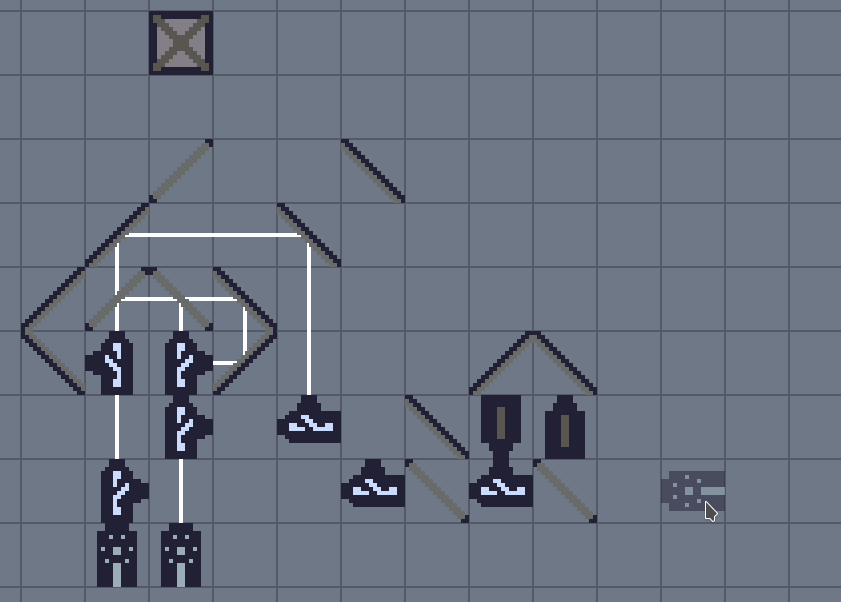

# Blink

Blink is a puzzle game involving lasers and mirrors, and is heavily inspired by
[Logic World](https://logicworld.net/) and
[OCTOPTICOM](https://store.steampowered.com/app/943190/OCTOPTICOM/).



## :warning: Important Note

I am considering closing the sources until well after the 1.0 release, and
releasing the game for a small price. As such, **I will not accept any
contributions for the time being**.

## Building
Dependencies:

* `zig 0.5.0`
* `SDL2`
* `SDL2_ttf`
* `libGL`
* `libepoxy`
* `libSOIL`

Blink uses the zig build system. If the dependencies are met, you can simply run
```
zig build
```

The makefile calls the zig build system if you prefer GNU make.

## Usage

```bash
./blink [save-file]
```

## Controls

* Left click to place an item, right click to remove
* Shift+Left click to place several items
* Hold left click to pan around
* Ctrl+mouse wheel to zoom in/out.
* Mouse wheel or 1-9 numbers to select an item
* Q and E to rotate the item
* F to flip switches
* Ctrl+left click to select
* Delete or backspace to delete selection
* Escape to clear selection
* F6 to save to "test.sav" (saving and loading is experimental)

## Available items

* **Block**: Blocks any rays hitting it
* **Laser**: Generates a light ray, always on.
* **Mirror**: Reflects light rays at a 90 degree angle.
* **Splitter**: Transparent mirror, will reflect *and* refract a light ray,
  effectivly splitting it. Can be used to merge rays as well.
* **Delayer**: Will delay the propagation of the ray by 1 tick.
* **Switch**: Will propagate the ray with a 1 tick delay like the delayer, but
  will cut the output when an input is received on the side.

